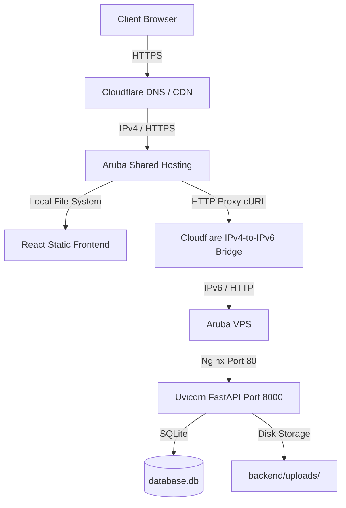

# Documentazione di Deploy e Architettura - The Archive

Questo documento descrive in dettaglio l'architettura di produzione del portfolio, il funzionamento del sistema di proxy ibrido e le istruzioni passo-passo per ripristinare o ricreare l'intero ambiente di deploy da zero.

---

## 1. Architettura di Produzione

Per superare i limiti fisici dell'hosting condiviso (incapace di eseguire processi Python persistenti) e della VPS (che possiede solo un indirizzo IPv6 ed è quindi invisibile ai client IPv4-only), abbiamo configurato un'**architettura ibrida** divisa su tre livelli:



### Componenti dell'Infrastruttura:
1. **Aruba Shared Hosting (Frontend)**: Ospita i file compilati in HTML/JS/CSS del frontend React. Quando un utente visita `matteoberga.com`, il server Apache di Aruba serve le pagine web statiche ad alta velocità.
2. **Cloudflare (DNS & Ponte IPv4-to-IPv6)**: Gestisce la risoluzione del dominio `matteoberga.com`. Per il sottodominio delle API (`api.matteoberga.com`), che punta all'indirizzo IPv6 della VPS, Cloudflare agisce come proxy dual-stack. Riceve le richieste in IPv4 da Aruba e le inoltra in IPv6 alla VPS.
3. **Aruba VPS (Backend & Database)**: Un server virtuale Ubuntu 24.04 LTS (solo IPv6). Esegue l'applicazione FastAPI su porta `8000` (tramite Uvicorn e Systemd) e gestisce il caricamento delle immagini e il database SQLite. Nginx fa da tramite locale sulla porta `80`.

---

## 2. Dettaglio del Flusso API (Il Proxy PHP)

Quando il frontend React effettua una richiesta API (es. caricare gli articoli o salvare una bozza):
1. La richiesta viene inviata a `https://matteoberga.com/api/works`.
2. Il file `.htaccess` su Aruba intercetta la richiesta e la devia silenziosamente a `api.php`.
3. Il file `api.php` esegue una chiamata cURL verso `http://api.matteoberga.com/api/works`.
4. Cloudflare riceve la chiamata da Aruba in IPv4, la traduce e la inoltra alla VPS in IPv6 su porta `80`.
5. Nginx sulla VPS riceve la chiamata e la passa al server Python (Uvicorn) sulla porta `8000`.
6. La risposta fa il percorso inverso fino al browser dell'utente.

*Vantaggio:* L'IP IPv6 della VPS non viene mai esposto pubblicamente, garantendo massima sicurezza contro attacchi diretti.

---

## 3. Guida al Ripristino da Zero (Re-deploy Completo)

Se dovessi acquistare un nuovo server o voler ricreare l'intero ecosistema, segui questa procedura.

### FASE A: Configurazione dei DNS e Cloudflare
1. Registrati su **Cloudflare** e aggiungi il tuo dominio `matteoberga.com`.
2. Cambia i **Name Server** nel pannello di gestione del dominio su Aruba con quelli forniti da Cloudflare:
   - `courtney.ns.cloudflare.com`
   - `miguel.ns.cloudflare.com`
3. Nella sezione DNS di Cloudflare, crea un record **AAAA**:
   - **Nome**: `api`
   - **Indirizzo IPv6**: L'IP IPv6 della tua VPS (es. `2a00:6d40:72:101::606`).
   - **Proxy status**: Attivo (Nuvoletta arancione).
4. Imposta la modalità di crittografia SSL/TLS globale di Cloudflare su **Full**.

---

### FASE B: Configurazione della VPS (Backend)
1. **Accedi alla VPS** tramite SSH o Console Web di Aruba:
   ```bash
   ssh -6 root@2a00:6d40:72:101::606
   ```
2. **Abilita la risoluzione DNS64** (Essenziale per scaricare pacchetti da siti solo IPv4 come GitHub, NPM e PyPI):
   ```bash
   echo -e "nameserver 2a00:1098:2c::1\nnameserver 2a00:1098:2b::1\nnameserver 2001:4860:4860::6464" > /etc/resolv.conf
   ```
3. **Clona il codice** da GitHub:
   ```bash
   git clone https://github.com/mttio/the_archive.git /var/www/the-archive
   ```
4. **Esegui lo script di setup automatico**:
   ```bash
   cd /var/www/the-archive
   chmod +x setup_vps.sh
   ./setup_vps.sh
   ```
   *Rispondi alle domande:*
   - **Domain**: `matteoberga.com`
   - **Passphrase**: Digita la password dell'amministratore per il pannello `/admin`.
   - **Configurare SSL (Certbot)**: Scegli **`n`** (No).
5. **Apri la porta 80 nel firewall di Ubuntu (`UFW`)**:
   ```bash
   ufw allow 80/tcp
   ```

---

### FASE C: Caricamento del Frontend su Aruba Hosting
1. **Compila il frontend** in locale sul tuo Mac:
   ```bash
   cd "/Users/matteoberga/Coding/The Archive by Matteo Berga/frontend"
   npm run build
   ```
2. Collegati tramite **SFTP** (porta `2222`) al tuo hosting Aruba.
3. Carica nella cartella principale di Aruba (solitamente `/` o `/web/htdocs/www.matteoberga.com/home/`) i seguenti file:
   - **Tutti i file all'interno di `frontend/dist/`** (`index.html`, cartella `assets`, ecc.).
   - Il file **`api.php`** (presente nella cartella principale del progetto).
   - Il file **`.htaccess`** (presente nella cartella principale del progetto).

---

## 4. Manutenzione e Aggiornamenti Quotidiani

Una volta configurato, l'aggiornamento del codice è molto semplice:

### Per aggiornare la grafica o le pagine (Frontend):
1. Fai le modifiche sul tuo Mac.
2. Esegui `npm run build` in `/frontend`.
3. Carica i nuovi file della cartella `/dist` su Aruba via SFTP (sovrascrivendo quelli vecchi). Non c'è bisogno di toccare `api.php` o `.htaccess`.

### Per aggiornare le funzioni o il database (Backend):
1. Fai le modifiche e caricale su GitHub.
2. Collegati alla VPS via SSH:
   ```bash
   ssh -6 root@2a00:6d40:72:101::606
   ```
3. Scarica gli aggiornamenti e riavvia il servizio:
   ```bash
   cd /var/www/the-archive
   git pull
   sudo systemctl restart portfolio-backend
   ```
   *Se hai aggiornato le dipendenze in `requirements.txt`, ricordati di attivare il venv ed eseguire `pip install -r requirements.txt` prima di riavviare.*
